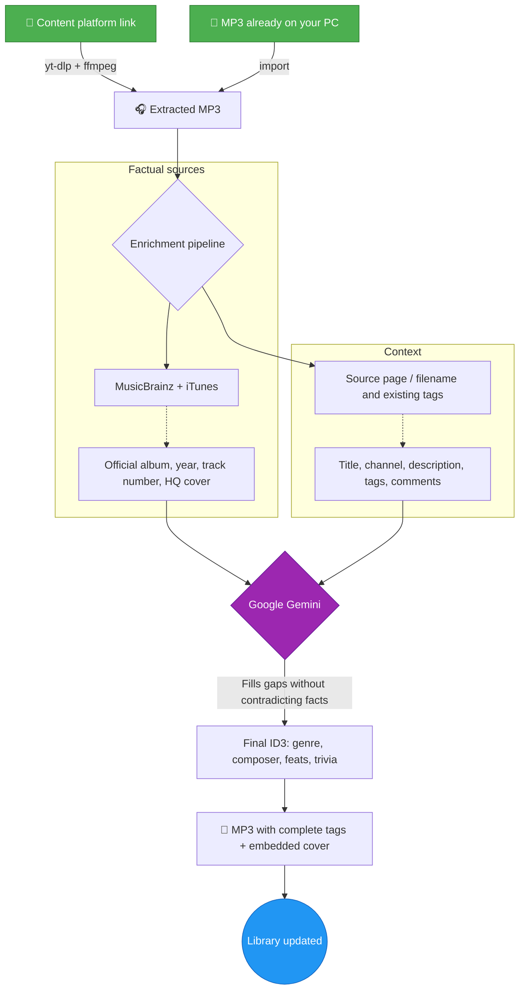
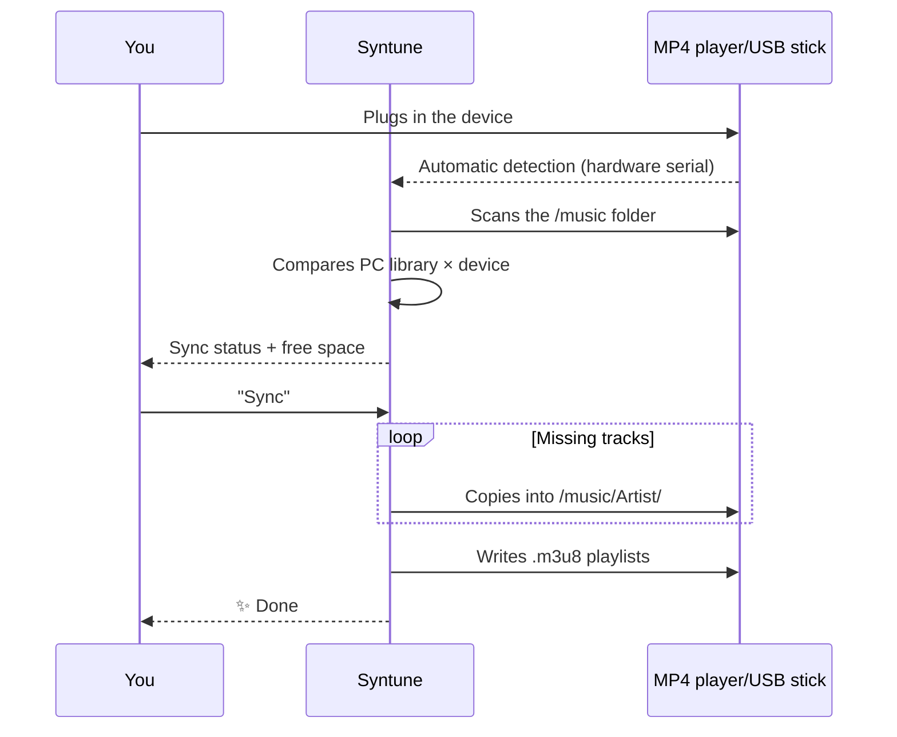

<div align="center">
  

  # 🎵 Syntune

  ### Your music. Your files. Forever.

  **The offline music organizer & player with the soul of a premium streaming app — supercharged by AI and powered by open data.**

  
  
  
  
  

  🌍 **English** · [Português (BR)](README.pt-BR.md)

  <br>

  [](https://github.com/marcoaur/syntune/releases/latest/download/Syntune-Setup.exe)

  <sub>or grab the [portable version](https://github.com/marcoaur/syntune/releases/latest/download/Syntune-Portable.exe) — no installation required · [all releases](https://github.com/marcoaur/syntune/releases)</sub>

</div>

---

## 👀 See it in action

<table>
  <tr>
    <td align="center" width="33%">
      <br>
      <sub><b>Immersive "Now Playing"</b> — the interface breathes the album's colors</sub>
    </td>
    <td align="center" width="33%">
      <br>
      <sub><b>Karaoke mode</b> — synced lyrics in real time</sub>
    </td>
    <td align="center" width="33%">
      <br>
      <sub><b>Lyrics editor</b> — time-sync line by line and publish to LRCLIB</sub>
    </td>
  </tr>
</table>

---

## 🌟 Why this exists

Streaming is renting. One day the catalog changes, a song vanishes from your playlist, the app demands a subscription — and that rare version you loved is gone.

Local files are **yours**. They play on the MP4 player in your pocket, on the USB stick in your car, on a PC with no internet, twenty years from now. The problem was never owning the files — it was caring for them: messy filenames, "Unknown Artist", missing covers, half-empty tags.

**Syntune** solves this end to end: it downloads, identifies, tags, beautifies, plays and syncs. With the precision of open music databases, the intelligence of Gemini to fill in the gaps, and an interface that makes your MP3s feel like a first-class streaming service — while never ceasing to be yours.

---

## ✨ What it does

| | Feature | Why it matters |
|:--|:--|:--|
| 📥 | **Content platform import** | Paste a link to content you are entitled to → MP3 with complete tags and a high-res cover. No manual steps. |
| 🧠 | **Fact-anchored AI enrichment** | MusicBrainz + iTunes provide the facts; Gemini only fills the gaps — never contradicts trusted data. Goodbye hallucinations. |
| 🔑 | **Works without an API key** | No Gemini key (or AI turned off)? **Factual mode** tags straight from MusicBrainz / iTunes / LRCLIB + high-res cover. AI is an optional boost — toggle it in Settings. |
| 🖼️ | **High-resolution covers** | Official artwork from Cover Art Archive and iTunes (600×600+), with a built-in cropper in the editor. |
| 🎤 | **Synced lyrics (karaoke)** | Automatic lookup on LRCLIB + a built-in editor to time-sync lyrics line by line. |
| 📡 | **Publish lyrics to LRCLIB** | Synced a lyric? Publish it straight from the app and it becomes public heritage. |
| 🎨 | **Living interface** | Each cover's dominant color tints cards, player and ambience. Real-time spectrum visualizer. |
| 🔊 | **Full-featured player** | Queue, shuffle, repeat, playlists, fullscreen "Now Playing" mode. |
| 🎛️ | **6-band equalizer** | Bass, mids and treble in real time via Web Audio — shape the sound to your taste. |
| 🖧 | **Device synchronization** | Detects MP4 players/USB sticks on plug-in, mirrors your library into `/music/Artist/` and writes `.m3u8` playlists. |
| 📊 | **Global stats + scrobbling** | Artist bios, listeners and play counts via Last.fm — and your plays feed your profile back. |
| 🪶 | **Genuinely lightweight** | Covers served through a native protocol (zero base64 in the JS heap), audio streamed straight from disk, offscreen content skipped at render time. |

---

## 🔄 How a link — or a file you already have — becomes a perfect track

The pipeline puts **facts before AI** — music databases are the primary source; Gemini is the specialist that completes and normalizes:



And then, without you asking: synced lyrics arrive from LRCLIB and the artist photo comes from Genius.

---

## 🚦 Smart queue — add 30 songs at once

The queue engine respects Gemini's API limits **per model** (RPM, TPM and RPD, persisted across sessions), processes enrichments in the order downloads finish, and shows the estimated wait in the UI whenever it has to pause.

**Recommended model: `gemini-3.1-flash-lite`** — fast, with far more generous free-tier limits:

| Model | RPM | TPM | RPD |
|:--|:--:|:--:|:--:|
| **`gemini-3.1-flash-lite`** ⭐ | **15** | **250,000** | **500** |
| `gemini-2.5-flash` | 5 | — | — |

Each track uses at most 2 requests — with flash-lite you enrich music **3× faster** without hitting rate-limit walls.

---

## 🖧 Your MP4 player, always up to date



Copying runs in a worker thread — the UI never freezes. Tracks that exist only on the device can be brought back, enriched and re-synced.

---

## 🤲 Powered by free services — and giving back to them

This app is only possible because people maintain, for free, some of the greatest treasures of music data on the internet. And here is the detail we are proud of: **Syntune doesn't just consume — it gives back.**

| Service | What we use | What we give back |
|:--|:--|:--|
| [MusicBrainz](https://musicbrainz.org) | Official album, year, track number | Rate limit religiously respected (1 req/s); you can [edit and complete data](https://musicbrainz.org/doc/How_to_Contribute) |
| [Cover Art Archive](https://coverartarchive.org) | Official high-res covers | — |
| [LRCLIB](https://lrclib.net) | Synced lyrics | **Lyrics you sync in the editor are published back** — every contribution becomes karaoke for the whole world |
| [Last.fm](https://www.last.fm) | Bios, global statistics | **Scrobbling your plays** feeds global popularity data |
| [Genius](https://genius.com) | Artist photos | — |
| iTunes Search | Genre, year, covers | — |

### 💛 Why contributing matters

Free music-data services live on a silent pact: every person who fixes a tag on MusicBrainz, publishes a lyric on LRCLIB or scrobbles a play is building the infrastructure the next user will receive ready-made. There is no company behind it guaranteeing anything — there are people.

If this app helped you, consider giving back to the ecosystem:

- 🎼 **Synced a lyric?** Publish it to LRCLIB right from the app — it takes one click.
- ✏️ **Spotted wrong data?** Fix it on [MusicBrainz](https://musicbrainz.org) — your edit benefits millions.
- 📷 **Own the official cover of a rare album?** Upload it to the [Cover Art Archive](https://coverartarchive.org).
- 💶 **Able to donate?** The [MetaBrainz Foundation](https://metabrainz.org/donate) keeps MusicBrainz alive.

Open data is like a public library: it only exists as long as the community takes care of it.

### 💿 And above all: pay for the music

The most direct way to care for the music you love is to **buy it**. An MP3 purchased from a trustworthy platform is yours forever — no DRM, no subscription, no vanishing catalog — and it puts money in the pocket of whoever created it:

- 🎸 **[Bandcamp](https://bandcamp.com)** — the gold standard: most of the money goes straight to the artist, DRM-free MP3/FLAC downloads
- 🎵 **[Qobuz](https://www.qobuz.com)** and **[7digital](https://www.7digital.com)** — high-quality download stores
- 🛒 The MP3 stores of **Amazon Music** and **iTunes/Apple Music**

Buying directly from **artists** is an act of curation: you vote, with money, for the music you want to keep existing.

### 🎙️ And if you create — create more

The other side of the coin: you also give back to music by **creating it**. If you produce your own music, **use this tool to make it look professional**: complete ID3 tags, a high-resolution embedded cover, synced lyrics, the composer's name in the right place. It's the finishing touch that separates a loose demo in a folder from a work ready to travel — on your MP4 player, on a friend's USB stick, on Bandcamp.

This app organizes your collection — but it's you who decides what goes into it. Including your own art.

---

## 🚀 Getting started

### 📦 1. Download (Windows x64)

- **[⬇️ Installer — Syntune-Setup.exe](https://github.com/marcoaur/syntune/releases/latest/download/Syntune-Setup.exe)** *(recommended)*
- **[⬇️ Portable — Syntune-Portable.exe](https://github.com/marcoaur/syntune/releases/latest/download/Syntune-Portable.exe)** — no installation, run from anywhere

No prerequisites: `yt-dlp` and `ffmpeg` are downloaded automatically the first time the app needs them.

### ⚙️ 2. First-run setup

1. Open **⚙️ Settings** in the app
2. *(Optional)* Paste a free **Gemini API key** ([get it at Google AI Studio](https://aistudio.google.com/apikey)) for AI enrichment — *without a key (or with the "Use AI" toggle off), the app runs in **factual mode** using MusicBrainz / iTunes / LRCLIB. Stored locally in `userData/config.json`; it never leaves your machine*
3. Choose your music library folder
4. *(Optional)* Add a **Genius** token for artist photos ([Genius API](https://genius.com/api-clients)) and a **Last.fm** key for stats and scrobbling ([Last.fm API](https://www.last.fm/api/account/create))

### 🧑‍💻 Running from source (developers)

Requires [Node.js](https://nodejs.org/) 18+ (tested on v22):

```bash
git clone https://github.com/marcoaur/syntune.git
cd syntune
npm install
npm start
```

### 🏗️ Production build (Windows)

```bash
npm run dist
```

Generates an NSIS installer + portable executable in `dist/`. The build is optimized: ffmpeg downloaded on demand, only pt/en Chromium locales, maximum compression.

---

## 🛠️ Stack & architecture

Deliberate minimalism: **two production dependencies** (`node-id3`, `yt-dlp-wrap`) and a 100% vanilla frontend.

```
main.js          Main process — downloads, Gemini pipeline, ID3, USB detection
preload.js       Secure IPC bridge (contextBridge, contextIsolation)
sync-worker.js   Worker thread — scanning and copying without freezing the UI
i18n.js          Internationalization (pt/en, resolved from the system locale)
renderer/        Vanilla JS + CSS — zero frameworks, zero dependencies
```

**Performance decisions worth studying:**

- 🚀 **Custom protocols** (`mp3file://`, `mp3cover://`, `mp3artist://`) — audio streamed straight from disk and covers served to Chromium's native image cache. No base64 bloating the JS heap, no buffers duplicated over IPC.
- 🦥 **Lazy at every layer** — covers with `loading="lazy"` + skeleton shimmer, `content-visibility: auto` skips offscreen rendering, ID3 reads that touch only the file header.
- 🎨 **Canvas API** to extract each cover's color palette; **Web Audio API** for the spectrum visualizer.
- 🧵 **Worker threads** for heavy sync I/O.

---

## 🤝 Contributing

Bugs, ideas, new metadata sources, UI polish — everything is welcome.

```bash
# 1. Fork and clone
# 2. Create your branch
git checkout -b feature/MyIdea
# 3. Commit
git commit -m "feat: my amazing idea"
# 4. Push and open a Pull Request
git push origin feature/MyIdea
```

Areas where help would make a real difference:

- 🌍 New languages (just add a JSON file to `locales/`)
- 🐧 USB device detection on Linux/macOS (Windows-only today)
- 🎵 New metadata sources (Discogs? Deezer?)
- ♿ Accessibility

---

## ⚖️ Legal notice

This software is intended for **personal use with your own or properly licensed content** — your recordings, openly licensed material, or content you are entitled to access offline. Respect the terms of service of the platforms you import content from and the copyright laws of your country. The authors do not endorse and are not responsible for misuse of this tool.

---

## 📄 License

[GPL-3.0](LICENSE) — use it, study it, modify it, share it. With one extra guarantee: **every derivative of this project stays free**. Anyone who modifies and redistributes it must keep the code open, under this same license, preserving the credits. Your work — and the work of everyone who contributes — never becomes someone else's closed product.

---

<div align="center">

**Made with 💜 for those who believe a music library is something you cultivate — not something you rent.**

🎧 *Let's make local libraries shine again.*

</div>
