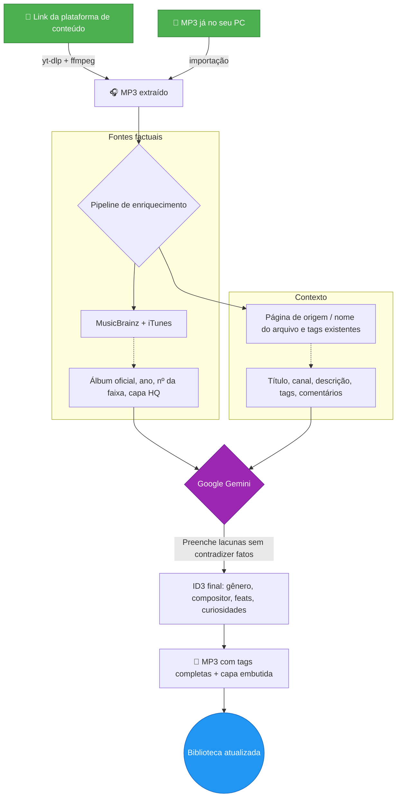
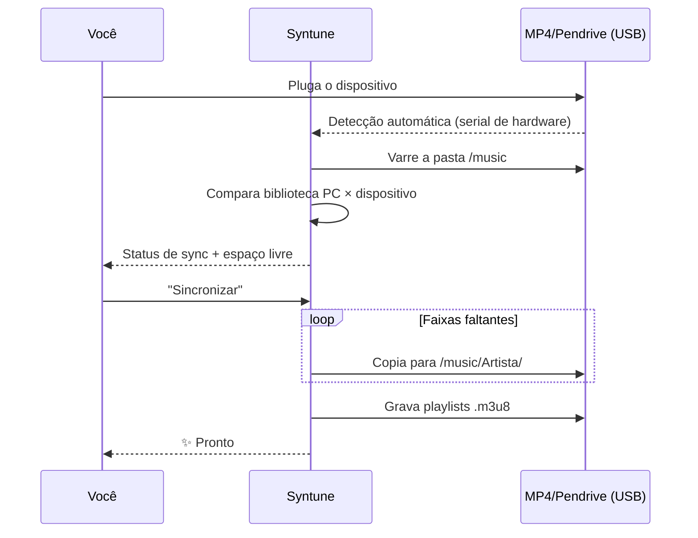

<div align="center">
  

  # 🎵 Syntune

  ### Sua música. Seus arquivos. Para sempre.

  **O organizador e player de música offline com alma de streaming premium — turbinado por IA e movido por dados abertos.**

  
  
  
  
  

  🌍 [English](README.md) · **Português (BR)**

  <br>

  [](https://github.com/marcoaur/syntune/releases/latest/download/Syntune-Setup.exe)

  <sub>ou baixe a [versão portátil](https://github.com/marcoaur/syntune/releases/latest/download/Syntune-Portable.exe) — sem instalação · [todas as versões](https://github.com/marcoaur/syntune/releases)</sub>

</div>

---

## 👀 Veja em ação

<table>
  <tr>
    <td align="center" width="33%">
      <br>
      <sub><b>"Tocando agora" imersivo</b> — a interface respira as cores do álbum</sub>
    </td>
    <td align="center" width="33%">
      <br>
      <sub><b>Modo karaokê</b> — letra sincronizada em tempo real</sub>
    </td>
    <td align="center" width="33%">
      <br>
      <sub><b>Editor de letras</b> — sincronize verso a verso e publique no LRCLIB</sub>
    </td>
  </tr>
</table>

---

## 🌟 Por que isso existe

Streaming é aluguel. Um dia o catálogo muda, a música some da playlist, o app exige assinatura — e aquela versão rara que você amava não existe mais.

Arquivos locais são **seus**. Tocam no MP4 do seu bolso, no pendrive do carro, no PC sem internet, daqui a vinte anos. O problema nunca foi ter os arquivos — foi cuidar deles: nomes bagunçados, "Artista Desconhecido", capas faltando, tags pela metade.

**Syntune** resolve isso de ponta a ponta: baixa, identifica, etiqueta, embeleza, toca e sincroniza. Com a precisão de bancos de dados musicais abertos, a inteligência do Gemini para preencher as lacunas, e uma interface que faz seus MP3 parecerem um serviço de streaming de primeira linha — sem nunca deixarem de ser seus.

---

## ✨ O que ele faz

| | Recurso | Por que importa |
|:--|:--|:--|
| 📥 | **Importação de plataformas de conteúdo** | Cole o link de um conteúdo ao qual você tem direito → MP3 com tags completas e capa em alta. Sem etapas manuais. |
| 🧠 | **Enriquecimento por IA ancorado em fatos** | MusicBrainz + iTunes trazem os fatos; o Gemini só preenche o que falta — nunca contradiz dados confiáveis. Adeus alucinação. |
| 🖼️ | **Capas em alta resolução** | Cover Art Archive e iTunes (600×600+), com recorte embutido no editor. |
| 🎤 | **Letras sincronizadas (karaokê)** | Busca automática no LRCLIB + editor próprio para sincronizar verso a verso. |
| 📡 | **Publicação de letras no LRCLIB** | Sincronizou uma letra? Publique direto do app e ela vira patrimônio público. |
| 🎨 | **Interface viva** | A cor dominante de cada capa tinge cards, player e ambiente. Visualizador de espectro em tempo real. |
| 🔊 | **Player completo** | Fila, shuffle, repeat, playlists, modo tela cheia "Tocando agora". |
| 🎛️ | **Equalizador de 6 bandas** | Graves, médios e agudos em tempo real via Web Audio — ajuste o som ao seu gosto. |
| 🖧 | **Sincronização com dispositivos** | Detecta MP4 player/pendrive ao plugar, espelha a biblioteca em `/music/Artista/` e gera playlists `.m3u8`. |
| 📊 | **Estatísticas globais + scrobble** | Bios, ouvintes e play counts via Last.fm — e suas reproduções alimentam seu perfil de volta. |
| 🪶 | **Leve de verdade** | Capas servidas por protocolo nativo (zero base64 no heap), áudio em streaming direto do disco, render só do que está na tela. |

---

## 🔄 Como um link — ou um arquivo que você já tem — vira uma faixa perfeita

O pipeline coloca **fatos antes de IA** — bancos de dados musicais são a fonte primária; o Gemini é o especialista que completa e normaliza:



E depois, sem você pedir: a letra sincronizada chega do LRCLIB e a foto do artista vem do Genius.

---

## 🚦 Fila inteligente — adicione 30 músicas de uma vez

O motor de fila respeita os limites da API do Gemini **por modelo** (RPM, TPM e RPD, persistido entre sessões), processa os enriquecimentos na ordem em que os downloads terminam e mostra na interface quanto falta quando precisa esperar.

**Modelo recomendado: `gemini-3.1-flash-lite`** — rápido e com limites gratuitos muito mais generosos:

| Modelo | RPM | TPM | RPD |
|:--|:--:|:--:|:--:|
| **`gemini-3.1-flash-lite`** ⭐ | **15** | **250.000** | **500** |
| `gemini-2.5-flash` | 5 | — | — |

Cada faixa usa no máximo 2 requisições — com o flash-lite, você enriquece **3× mais rápido** sem esbarrar em limite.

---

## 🖧 Seu MP4 player sempre em dia



A cópia roda num worker thread — a interface nunca trava. Faixas que só existem no dispositivo podem ser trazidas de volta, enriquecidas e re-sincronizadas.

---

## 🤲 Movido por serviços livres — e devolvendo para eles

Este app só é possível porque pessoas mantêm, de graça, alguns dos maiores tesouros de dados musicais da internet. E aqui está o detalhe que nos orgulha: **o Syntune não só consome — ele devolve.**

| Serviço | O que usamos | O que devolvemos |
|:--|:--|:--|
| [MusicBrainz](https://musicbrainz.org) | Álbum, ano, nº da faixa oficiais | Rate limit respeitado religiosamente (1 req/s); você pode [editar e completar dados](https://musicbrainz.org/doc/How_to_Contribute) |
| [Cover Art Archive](https://coverartarchive.org) | Capas oficiais em alta | — |
| [LRCLIB](https://lrclib.net) | Letras sincronizadas | **Letras que você sincroniza no editor são publicadas de volta** — cada contribuição vira karaokê para o mundo inteiro |
| [Last.fm](https://www.last.fm) | Bios, estatísticas globais | **Scrobble das suas reproduções** alimenta os dados globais de popularidade |
| [Genius](https://genius.com) | Fotos de artistas | — |
| iTunes Search | Gênero, ano, capas | — |

### 💛 Por que contribuir importa

Serviços gratuitos de dados musicais vivem de um pacto silencioso: cada pessoa que corrige uma tag no MusicBrainz, publica uma letra no LRCLIB ou faz scrobble está construindo a infraestrutura que o próximo usuário vai receber pronta. Não existe empresa por trás garantindo isso — existe gente.

Se este app te ajudou, considere retribuir o ecossistema:

- 🎼 **Sincronizou uma letra?** Publique no LRCLIB direto pelo app — leva um clique.
- ✏️ **Achou um dado errado?** Corrija no [MusicBrainz](https://musicbrainz.org) — sua edição beneficia milhões.
- 📷 **Tem a capa oficial de um álbum raro?** Suba no [Cover Art Archive](https://coverartarchive.org).
- 💶 **Pode doar?** A [MetaBrainz Foundation](https://metabrainz.org/donate) mantém o MusicBrainz vivo.

Dados abertos são como uma biblioteca pública: só existem enquanto a comunidade cuidar deles.

### 💿 E acima de tudo: pague pela música

A forma mais direta de cuidar da música que você ama é **comprá-la**. Um MP3 comprado em uma plataforma confiável é seu para sempre — sem DRM, sem assinatura, sem catálogo que desaparece — e coloca dinheiro no bolso de quem criou:

- 🎸 **[Bandcamp](https://bandcamp.com)** — a referência: a maior parte do valor vai direto ao artista, downloads em MP3/FLAC sem DRM
- 🎵 **[Qobuz](https://www.qobuz.com)** e **[7digital](https://www.7digital.com)** — lojas de download em alta qualidade
- 🛒 Lojas de MP3 da **Amazon Music** e **iTunes/Apple Music**

Comprar direto dos **artistas** é um ato de curadoria: você vota, com dinheiro, na música que quer que continue existindo.

### 🎙️ E se você cria — crie mais

O outro lado da moeda: música também se retribui **criando**. Se você produz sua própria música, **use esta ferramenta para deixá-la com cara de profissional**: tags ID3 completas, capa em alta resolução embutida, letra sincronizada, nome de compositor no lugar certo. É o acabamento que separa uma demo solta numa pasta de uma obra pronta para circular — no seu MP4 player, no pendrive de um amigo, no Bandcamp.

Este app organiza sua coleção — mas é você quem decide o que entra nela. Inclusive a sua própria arte.

---

## 🚀 Começando

### 📦 1. Baixe (Windows x64)

- **[⬇️ Instalador — Syntune-Setup.exe](https://github.com/marcoaur/syntune/releases/latest/download/Syntune-Setup.exe)** *(recomendado)*
- **[⬇️ Portátil — Syntune-Portable.exe](https://github.com/marcoaur/syntune/releases/latest/download/Syntune-Portable.exe)** — sem instalação, rode de onde quiser

Sem pré-requisitos: `yt-dlp` e `ffmpeg` são baixados automaticamente na primeira vez que o app precisar deles.

### ⚙️ 2. Primeira configuração

1. Abra **⚙️ Configurações** no app
2. Cole sua chave gratuita da **API do Gemini** ([pegue no Google AI Studio](https://aistudio.google.com/apikey)) — *fica salva localmente em `userData/config.json`, nunca sai da sua máquina*
3. Escolha a pasta da sua biblioteca de músicas
4. *(Opcional)* Adicione um token do **Genius** para fotos de artistas ([Genius API](https://genius.com/api-clients)) e uma chave do **Last.fm** para estatísticas e scrobble ([Last.fm API](https://www.last.fm/api/account/create))

### 🧑‍💻 Rodando pelo código-fonte (desenvolvedores)

Requer [Node.js](https://nodejs.org/) 18+ (testado na v22):

```bash
git clone https://github.com/marcoaur/syntune.git
cd syntune
npm install
npm start
```

### 🏗️ Build de produção (Windows)

```bash
npm run dist
```

Gera instalador NSIS + executável portátil em `dist/`. O build é otimizado: ffmpeg baixado sob demanda, apenas locales pt/en do Chromium, compressão máxima.

---

## 🛠️ Stack & arquitetura

Minimalismo deliberado: **duas dependências de produção** (`node-id3`, `yt-dlp-wrap`) e frontend 100% vanilla.

```
main.js          Processo principal — downloads, pipeline Gemini, ID3, detecção USB
preload.js       Ponte IPC segura (contextBridge, contextIsolation)
sync-worker.js   Worker thread — varredura e cópia sem travar a UI
i18n.js          Internacionalização (pt/en, resolvida pelo locale do sistema)
renderer/        Vanilla JS + CSS — zero frameworks, zero dependências
```

**Decisões de performance que valem estudar:**

- 🚀 **Protocolos custom** (`mp3file://`, `mp3cover://`, `mp3artist://`) — áudio em streaming direto do disco e capas servidas ao cache de imagens nativo do Chromium. Nada de base64 inflando o heap JS, nada de buffers duplicados via IPC.
- 🦥 **Lazy em todas as camadas** — capas com `loading="lazy"` + skeleton shimmer, `content-visibility: auto` pula render do que está fora da tela, leitura ID3 que lê só o cabeçalho do arquivo.
- 🎨 **Canvas API** para extrair a paleta de cores de cada capa; **Web Audio API** para o visualizador de espectro.
- 🧵 **Worker threads** para I/O pesado de sincronização.

---

## 🤝 Contribuindo

Bug, ideia, nova fonte de metadados, polimento de UI — tudo é bem-vindo.

```bash
# 1. Fork e clone
# 2. Crie sua branch
git checkout -b feature/MinhaIdeia
# 3. Commit
git commit -m "feat: minha ideia incrível"
# 4. Push e abra um Pull Request
git push origin feature/MinhaIdeia
```

Áreas onde ajuda faria diferença real:

- 🌍 Novos idiomas (basta adicionar um JSON em `locales/`)
- 🐧 Detecção de dispositivos USB em Linux/macOS (hoje só Windows)
- 🎵 Novas fontes de metadados (Discogs? Deezer?)
- ♿ Acessibilidade

---

## ⚖️ Aviso legal

Este software destina-se ao **uso pessoal com conteúdo próprio ou devidamente licenciado** — suas gravações, conteúdos sob licença aberta ou materiais aos quais você tem direito de acesso offline. Respeite os termos de uso das plataformas de onde importa conteúdo e a legislação de direitos autorais do seu país. Os autores não endossam nem se responsabilizam pelo uso indevido da ferramenta.

---

## 📄 Licença

[GPL-3.0](LICENSE) — use, estude, modifique, distribua. Com uma garantia a mais: **todo derivado deste projeto permanece livre**. Quem modificar e redistribuir precisa manter o código aberto, sob esta mesma licença, preservando os créditos. Seu trabalho — e o de todos que contribuírem — nunca vira produto fechado de terceiros.

---

<div align="center">

**Feito com 💜 para quem acredita que biblioteca de música é coisa que se cultiva — não que se aluga.**

🎧 *Vamos fazer as bibliotecas locais brilharem de novo.*

</div>
