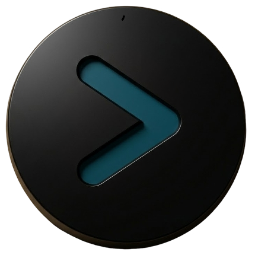
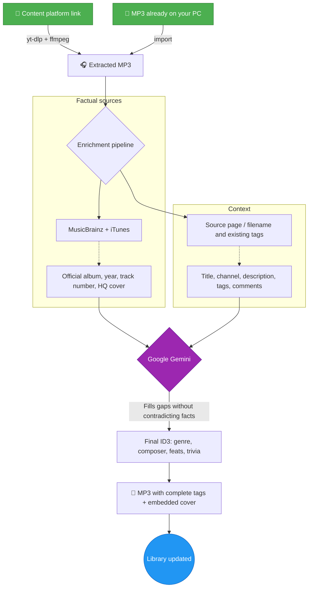
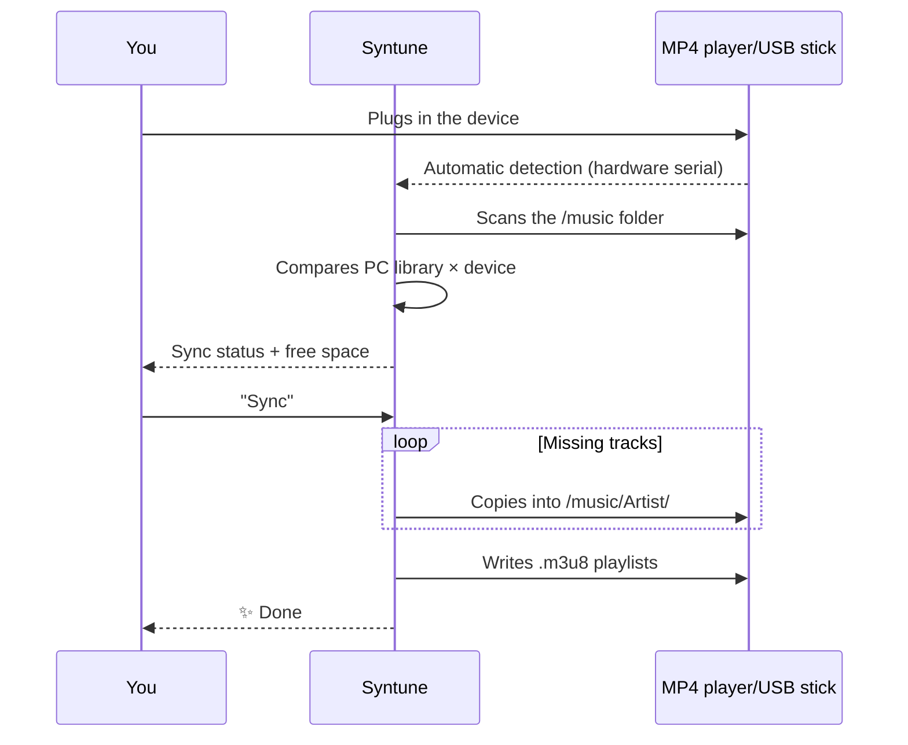

<div align="center">
  

  # 🎵 Syntune

  ### Ваша музыка. Ваши файлы. Навсегда.

  **Организуйте, обогащайте и владейте своей музыкальной библиотекой — офлайн и приватно. Лоск стриминга, без аренды.**

  
  
  
  
  

  🌍 [English](README.md) · [Português (BR)](README.pt-BR.md) · [Español](README.es.md) · [Français](README.fr.md) · [Deutsch](README.de.md) · **Русский**

  <br>

  [](https://github.com/marcoaur/syntune/releases/latest/download/Syntune-Setup.exe)

  <sub>или возьмите [портативную версию](https://github.com/marcoaur/syntune/releases/latest/download/Syntune-Portable.exe) — без установки · [все версии](https://github.com/marcoaur/syntune/releases)</sub>

</div>

---

## 👀 В действии

<table>
  <tr>
    <td align="center" width="33%">
      <br>
      <sub><b>Иммерсивное «Сейчас играет»</b> — интерфейс дышит цветами альбома</sub>
    </td>
    <td align="center" width="33%">
      <br>
      <sub><b>Режим караоке</b> — синхронизированный текст в реальном времени</sub>
    </td>
    <td align="center" width="33%">
      <br>
      <sub><b>Редактор текста</b> — синхронизируйте построчно и публикуйте в LRCLIB</sub>
    </td>
  </tr>
</table>

---

## 🌟 Зачем это нужно

Стриминг — это аренда. Однажды меняется каталог, песня исчезает из плейлиста, приложение требует подписку — и той редкой версии, которую вы любили, больше нет.

Локальные файлы — **ваши**. Они играют на MP4-плеере в кармане, на флешке в машине, на ПК без интернета, через двадцать лет. Проблема никогда не была в том, чтобы владеть файлами — а в том, чтобы заботиться о них: беспорядочные имена, «Неизвестный исполнитель», отсутствующие обложки, наполовину пустые теги.

**Syntune** заботится об этой библиотеке: организует, распознаёт, тегирует, украшает, проигрывает и синхронизирует вашу музыку — а когда нужен трек, на который у вас есть право, достаёт его и по ссылке. С точностью открытых музыкальных баз данных (и необязательным ИИ для заполнения пробелов) он делает ваши MP3 похожими на первоклассный стриминг — не переставая быть вашими.

---

## ✨ Что он умеет

| | Возможность | Почему это важно |
|:--|:--|:--|
| 🧠 | **Обогащение ИИ на основе фактов** | MusicBrainz + iTunes дают факты; Gemini лишь заполняет пробелы — никогда не противоречит надёжным данным. Прощайте, галлюцинации. |
| 🔑 | **Работает без API-ключа** | Нет ключа Gemini (или ИИ выключен)? **Фактический режим** тегирует напрямую из MusicBrainz / iTunes / LRCLIB + обложка высокого разрешения. ИИ — необязательное усиление; включите его в настройках. |
| 🖼️ | **Обложки высокого разрешения** | Официальные обложки из Cover Art Archive и iTunes (600×600+), со встроенным кадрированием в редакторе. |
| 🎤 | **Синхронизированный текст (караоке)** | Автопоиск в LRCLIB + встроенный редактор для построчной синхронизации текста. |
| 📡 | **Публикация текстов в LRCLIB** | Синхронизировали текст? Опубликуйте его прямо из приложения — и он станет общим достоянием. |
| 📥 | **Достаньте треки по ссылке** | Нужен трек, на который у вас есть право? Вставьте ссылку → MP3 с полными тегами и обложкой высокого разрешения. Без ручных шагов. |
| 🎨 | **Живой интерфейс** | Доминирующий цвет каждой обложки окрашивает карточки, плеер и фон. Визуализатор спектра в реальном времени. |
| 🔊 | **Полнофункциональный плеер** | Очередь, перемешивание, повтор, плейлисты, полноэкранный режим «Сейчас играет». |
| 🎛️ | **6-полосный эквалайзер** | Низкие, средние и высокие в реальном времени через Web Audio — настройте звук по вкусу. |
| 🖧 | **Синхронизация с устройствами** | Распознаёт MP4-плееры/флешки при подключении, зеркалит библиотеку в `/music/Исполнитель/` и пишет плейлисты `.m3u8`. |
| 📊 | **Мировая статистика + скробблинг** | Биографии, слушатели и прослушивания через Last.fm — а ваши прослушивания пополняют ваш профиль. |
| 🪶 | **По-настоящему лёгкий** | Обложки отдаются через нативный протокол (ноль base64 в куче JS), аудио стримится прямо с диска, контент вне экрана пропускается при отрисовке. |

---

## 🔄 Как ссылка — или уже имеющийся файл — становится идеальным треком

Конвейер ставит **факты выше ИИ** — музыкальные базы данных являются первичным источником; Gemini — специалист, который дополняет и нормализует:



А затем, без вашего запроса: синхронизированный текст приходит из LRCLIB, а фото исполнителя — из Genius.

---

## 🚦 Умная очередь — добавьте 30 песен сразу

Движок очереди соблюдает лимиты API Gemini **по каждой модели** (RPM, TPM и RPD, сохраняются между сессиями), обрабатывает обогащение в порядке завершения загрузок и показывает в интерфейсе ожидаемое время, когда нужно сделать паузу.

**Рекомендуемая модель: `gemini-3.1-flash-lite`** — быстрая, с гораздо более щедрыми лимитами бесплатного уровня:

| Модель | RPM | TPM | RPD |
|:--|:--:|:--:|:--:|
| **`gemini-3.1-flash-lite`** ⭐ | **15** | **250 000** | **500** |
| `gemini-2.5-flash` | 5 | — | — |

Каждый трек использует не более 2 запросов — с flash-lite вы обогащаете музыку **в 3 раза быстрее**, не упираясь в лимиты.

---

## 🖧 Ваш MP4-плеер всегда актуален



Копирование выполняется в рабочем потоке — интерфейс никогда не зависает. Треки, которые есть только на устройстве, можно вернуть, обогатить и синхронизировать заново.

---

## 🤲 На основе бесплатных сервисов — и отдача им

Это приложение возможно лишь потому, что люди бесплатно поддерживают одни из величайших сокровищ музыкальных данных в интернете. И вот деталь, которой мы гордимся: **Syntune не только потребляет — он отдаёт.**

| Сервис | Что мы используем | Что мы отдаём |
|:--|:--|:--|
| [MusicBrainz](https://musicbrainz.org) | Официальный альбом, год, номер трека | Лимит запросов строго соблюдается (1 запр./с); вы можете [редактировать и дополнять данные](https://musicbrainz.org/doc/How_to_Contribute) |
| [Cover Art Archive](https://coverartarchive.org) | Официальные обложки высокого разрешения | — |
| [LRCLIB](https://lrclib.net) | Синхронизированные тексты | **Тексты, которые вы синхронизируете в редакторе, публикуются обратно** — каждый вклад становится караоке для всего мира |
| [Last.fm](https://www.last.fm) | Биографии, мировая статистика | **Скробблинг ваших прослушиваний** пополняет глобальные данные о популярности |
| [Genius](https://genius.com) | Фото исполнителей | — |
| iTunes Search | Жанр, год, обложки | — |

### 💛 Почему вклад важен

Бесплатные сервисы музыкальных данных держатся на негласном уговоре: каждый, кто исправляет тег в MusicBrainz, публикует текст в LRCLIB или скробблит прослушивание, строит инфраструктуру, которую следующий пользователь получит готовой. За этим не стоит компания, что-либо гарантирующая — за этим стоят люди.

Если приложение вам помогло, подумайте о том, чтобы отдать что-то экосистеме:

- 🎼 **Синхронизировали текст?** Опубликуйте его в LRCLIB прямо из приложения — это один клик.
- ✏️ **Заметили неверные данные?** Исправьте их в [MusicBrainz](https://musicbrainz.org) — ваша правка принесёт пользу миллионам.
- 📷 **У вас есть официальная обложка редкого альбома?** Загрузите её в [Cover Art Archive](https://coverartarchive.org).
- 💶 **Можете пожертвовать?** [Фонд MetaBrainz](https://metabrainz.org/donate) поддерживает MusicBrainz.

Открытые данные подобны публичной библиотеке: они существуют, лишь пока сообщество о них заботится.

### 💿 И прежде всего: платите за музыку

Самый прямой способ позаботиться о любимой музыке — **купить её**. MP3, купленный на надёжной платформе, ваш навсегда — без DRM, без подписки, без исчезающего каталога — и он кладёт деньги в карман тому, кто её создал:

- 🎸 **[Bandcamp](https://bandcamp.com)** — золотой стандарт: большая часть денег идёт напрямую артисту, загрузки MP3/FLAC без DRM
- 🎵 **[Qobuz](https://www.qobuz.com)** и **[7digital](https://www.7digital.com)** — магазины загрузок высокого качества
- 🛒 MP3-магазины **Amazon Music** и **iTunes/Apple Music**

Покупка напрямую у **артистов** — это акт кураторства: вы голосуете деньгами за музыку, которую хотите сохранить.

### 🎙️ А если вы создаёте — создавайте больше

Обратная сторона медали: вы отдаёте музыке и тем, что **создаёте её**. Если вы пишете собственную музыку, **используйте этот инструмент, чтобы придать ей профессиональный вид**: полные ID3-теги, встроенная обложка высокого разрешения, синхронизированный текст, имя композитора на своём месте. Это финальный штрих, отличающий разрозненное демо в папке от произведения, готового путешествовать — на вашем MP4-плеере, на флешке друга, на Bandcamp.

Это приложение организует вашу коллекцию — но вы решаете, что в неё входит. В том числе ваше собственное творчество.

---

## 🚀 Начало работы

### 📦 1. Загрузка

**Windows x64**
- **[⬇️ Установщик — Syntune-Setup.exe](https://github.com/marcoaur/syntune/releases/latest/download/Syntune-Setup.exe)** *(рекомендуется)*
- **[⬇️ Портативная — Syntune-Portable.exe](https://github.com/marcoaur/syntune/releases/latest/download/Syntune-Portable.exe)** — без установки, запуск откуда угодно

**macOS** (Apple Silicon) и **Linux** — возьмите `.dmg` / `.AppImage` / `.deb` в **[последней версии](https://github.com/marcoaur/syntune/releases/latest)**.
> Сборки для macOS и Linux пока не подписаны — macOS может предупредить («неустановленный разработчик»); правый клик → Открыть. AppImage: `chmod +x`, затем запустите.

Без предварительных требований: `yt-dlp` и `ffmpeg` загружаются автоматически при первой необходимости.

### ⚙️ 2. Первоначальная настройка

1. Откройте **⚙️ Настройки** в приложении
2. *(Необязательно)* Вставьте бесплатный **API-ключ Gemini** ([получите его в Google AI Studio](https://aistudio.google.com/apikey)) для обогащения ИИ — *без ключа (или с выключенным переключателем «Использовать ИИ») приложение работает в **фактическом режиме** с MusicBrainz / iTunes / LRCLIB. Хранится локально в `userData/config.json`; никогда не покидает ваше устройство*
3. Выберите папку музыкальной библиотеки
4. *(Необязательно)* Добавьте токен **Genius** для фото исполнителей ([Genius API](https://genius.com/api-clients)) и ключ **Last.fm** для статистики и скробблинга ([Last.fm API](https://www.last.fm/api/account/create))

### 🧑‍💻 Запуск из исходников (разработчикам)

Требуется [Node.js](https://nodejs.org/) 18+ (проверено на v22):

```bash
git clone https://github.com/marcoaur/syntune.git
cd syntune
npm install
npm start
```

### 🏗️ Продакшен-сборка

```bash
npm run dist
```

Создаёт установщики в `dist/`. Сборка оптимизирована: ffmpeg по требованию, максимальное сжатие.

---

## 🛠️ Стек и архитектура

Намеренный минимализм: **две продакшен-зависимости** (`node-id3`, `yt-dlp-wrap`) и 100 % ванильный фронтенд.

```
main.js          Главный процесс — загрузки, конвейер Gemini, ID3, обнаружение USB
preload.js       Безопасный мост IPC (contextBridge, contextIsolation)
sync-worker.js   Рабочий поток — сканирование и копирование без зависания UI
i18n.js          Интернационализация (определяется по локали системы)
renderer/        Ванильный JS + CSS — ноль фреймворков, ноль зависимостей
```

**Решения по производительности, которые стоит изучить:**

- 🚀 **Собственные протоколы** (`mp3file://`, `mp3cover://`, `mp3artist://`) — аудио стримится прямо с диска, а обложки отдаются нативному кешу изображений Chromium. Нет base64, раздувающего кучу JS, нет буферов, дублируемых через IPC.
- 🦥 **Ленивость на каждом уровне** — обложки с `loading="lazy"` + скелетон, `content-visibility: auto` пропускает отрисовку вне экрана, чтение ID3 затрагивает только заголовок файла.
- 🎨 **Canvas API** для извлечения палитры каждой обложки; **Web Audio API** для визуализатора спектра.
- 🧵 **Рабочие потоки** для тяжёлого ввода-вывода синхронизации.

---

## 🤝 Участие

Баги, идеи, новые источники метаданных, доработки интерфейса — всё приветствуется.

```bash
# 1. Сделайте форк и клонируйте
# 2. Создайте ветку
git checkout -b feature/MoyaIdeya
# 3. Закоммитьте
git commit -m "feat: моя классная идея"
# 4. Запушьте и откройте Pull Request
git push origin feature/MoyaIdeya
```

Области, где помощь действительно изменит ситуацию:

- 🌍 Новые языки (просто добавьте файл JSON в `locales/`)
- 🐧 Обнаружение USB-устройств в Linux/macOS (сейчас только Windows)
- 🎵 Новые источники метаданных (Discogs? Deezer?)
- ♿ Доступность

---

## ⚖️ Правовое уведомление

Это программное обеспечение предназначено для **личного использования с вашим собственным или должным образом лицензированным контентом** — вашими записями, материалами под открытой лицензией или контентом, к которому у вас есть право офлайн-доступа. Соблюдайте условия использования платформ, с которых вы импортируете контент, и законы об авторском праве вашей страны. Авторы не одобряют злоупотребление этим инструментом и не несут за него ответственности.

---

## 📄 Лицензия

[GPL-3.0](LICENSE) — используйте, изучайте, изменяйте, делитесь. С одной дополнительной гарантией: **каждая производная этого проекта остаётся свободной**. Тот, кто изменяет и распространяет её, обязан сохранять код открытым, под этой же лицензией, с сохранением авторства. Ваша работа — и работа всех участников — никогда не станет чьим-то закрытым продуктом.

---

<div align="center">

**Сделано с 💜 для тех, кто верит, что музыкальную библиотеку выращивают — а не арендуют.**

🎧 *Давайте снова зажжём локальные библиотеки.*

</div>
