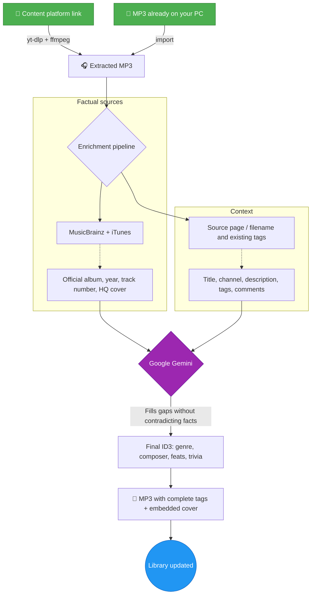
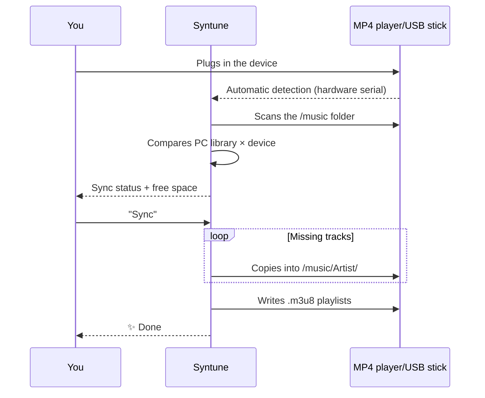

<div align="center">
  

  # 🎵 Syntune

  ### Deine Musik. Deine Dateien. Für immer.

  **Organisiere, bereichere und besitze deine Musikbibliothek — offline und privat. Streaming-Politur, ohne die Miete.**

  
  
  
  
  

  🌍 [English](../README.md) · [Português (BR)](README.pt-BR.md) · [Español](README.es.md) · [Français](README.fr.md) · **Deutsch** · [Русский](README.ru.md)

  <br>

  [](https://github.com/marcoaur/syntune/releases/latest/download/Syntune-Setup.exe)

  <sub>oder hol dir die [portable Version](https://github.com/marcoaur/syntune/releases/latest/download/Syntune-Portable.exe) — keine Installation nötig · [alle Versionen](https://github.com/marcoaur/syntune/releases)</sub>

</div>

---

## 👀 In Aktion

<table>
  <tr>
    <td align="center" width="33%">
      <br>
      <sub><b>Immersives „Wiedergabe“</b> — die Oberfläche atmet die Farben des Albums</sub>
    </td>
    <td align="center" width="33%">
      <br>
      <sub><b>Karaoke-Modus</b> — synchronisierter Songtext in Echtzeit</sub>
    </td>
    <td align="center" width="33%">
      <br>
      <sub><b>Songtext-Editor</b> — Zeile für Zeile synchronisieren und auf LRCLIB veröffentlichen</sub>
    </td>
  </tr>
</table>

---

## 🌟 Warum es das gibt

Streaming ist Miete. Eines Tages ändert sich der Katalog, ein Song verschwindet aus deiner Playlist, die App verlangt ein Abo — und die seltene Version, die du geliebt hast, ist weg.

Lokale Dateien sind **deine**. Sie laufen auf dem MP4-Player in deiner Tasche, auf dem USB-Stick im Auto, auf einem PC ohne Internet, in zwanzig Jahren. Das Problem war nie, die Dateien zu besitzen — sondern, sich um sie zu kümmern: chaotische Dateinamen, „Unbekannter Interpret“, fehlende Cover, halb leere Tags.

**Syntune** kümmert sich um diese Bibliothek: Es organisiert, identifiziert, taggt, verschönert, spielt ab und synchronisiert deine Musik — und wenn du einen Titel brauchst, auf den du Anrecht hast, holt es ihn auch über einen Link. Mit der Präzision offener Musikdatenbanken (und optionaler KI für die Lücken) lässt es deine MP3s wie einen erstklassigen Streamingdienst wirken — ohne je aufzuhören, deine zu sein.

---

## ✨ Was es kann

| | Funktion | Warum es zählt |
|:--|:--|:--|
| 🧠 | **Faktenbasierte KI-Anreicherung** | MusicBrainz + iTunes liefern die Fakten; Gemini füllt nur die Lücken — widerspricht nie vertrauenswürdigen Daten. Tschüss Halluzinationen. |
| 🔑 | **Funktioniert ohne API-Schlüssel** | Kein Gemini-Schlüssel (oder KI aus)? Der **Faktenmodus** taggt direkt aus MusicBrainz / iTunes / LRCLIB + hochauflösendes Cover. KI ist ein optionaler Schub — schalte sie in den Einstellungen ein. |
| 🖼️ | **Hochauflösende Cover** | Offizielle Artworks von Cover Art Archive und iTunes (600×600+), mit integriertem Zuschneiden im Editor. |
| 🎤 | **Synchronisierter Songtext (Karaoke)** | Automatische Suche auf LRCLIB + ein integrierter Editor zum zeilenweisen Synchronisieren. |
| 📡 | **Songtexte auf LRCLIB veröffentlichen** | Einen Text synchronisiert? Veröffentliche ihn direkt aus der App — und er wird öffentliches Kulturgut. |
| 📥 | **Titel über einen Link holen** | Brauchst du einen Titel, auf den du Anrecht hast? Link einfügen → MP3 mit vollständigen Tags und hochauflösendem Cover. Keine manuellen Schritte. |
| 🎨 | **Lebendige Oberfläche** | Die dominante Farbe jedes Covers färbt Karten, Player und Ambiente. Echtzeit-Spektrumvisualisierung. |
| 🔊 | **Voll ausgestatteter Player** | Warteschlange, Zufall, Wiederholung, Playlists, Vollbild-„Wiedergabe“. |
| 🎛️ | **6-Band-Equalizer** | Bässe, Mitten und Höhen in Echtzeit über Web Audio — forme den Klang nach deinem Geschmack. |
| 🖧 | **Gerätesynchronisierung** | Erkennt MP4-Player/USB-Sticks beim Anstecken, spiegelt deine Bibliothek nach `/music/Interpret/` und schreibt `.m3u8`-Playlists. |
| 📊 | **Globale Statistiken + Scrobbling** | Biografien, Hörer und Wiedergaben über Last.fm — und deine Wiedergaben fließen in dein Profil zurück. |
| 🪶 | **Wirklich leichtgewichtig** | Cover über ein natives Protokoll ausgeliefert (kein base64 im JS-Heap), Audio direkt von der Festplatte gestreamt, Inhalte außerhalb des Sichtbereichs beim Rendern übersprungen. |

---

## 🔄 Wie ein Link — oder eine Datei, die du schon hast — zum perfekten Titel wird

Die Pipeline stellt **Fakten vor KI** — Musikdatenbanken sind die primäre Quelle; Gemini ist der Spezialist, der ergänzt und normalisiert:



Und dann, ohne dass du fragst: Der synchronisierte Songtext kommt von LRCLIB und das Interpretenfoto von Genius.

---

## 🚦 Intelligente Warteschlange — füge 30 Songs auf einmal hinzu

Die Warteschlangen-Engine respektiert die Gemini-API-Limits **pro Modell** (RPM, TPM und RPD, über Sitzungen hinweg gespeichert), verarbeitet Anreicherungen in der Reihenfolge, in der die Downloads fertig werden, und zeigt die geschätzte Wartezeit an, wann immer sie pausieren muss.

**Empfohlenes Modell: `gemini-3.1-flash-lite`** — schnell und mit viel großzügigeren Free-Tier-Limits:

| Modell | RPM | TPM | RPD |
|:--|:--:|:--:|:--:|
| **`gemini-3.1-flash-lite`** ⭐ | **15** | **250.000** | **500** |
| `gemini-2.5-flash` | 5 | — | — |

Jeder Titel braucht höchstens 2 Anfragen — mit flash-lite reicherst du Musik **3× schneller** an, ohne an Rate-Limit-Wände zu stoßen.

---

## 🖧 Dein MP4-Player, immer aktuell



Das Kopieren läuft in einem Worker-Thread — die Oberfläche friert nie ein. Titel, die nur auf dem Gerät existieren, lassen sich zurückholen, anreichern und neu synchronisieren.

---

## 🤲 Angetrieben von kostenlosen Diensten — und ihnen etwas zurückgeben

Diese App ist nur möglich, weil Menschen kostenlos einige der größten Schätze an Musikdaten im Internet pflegen. Und das ist das Detail, auf das wir stolz sind: **Syntune konsumiert nicht nur — es gibt zurück.**

| Dienst | Was wir nutzen | Was wir zurückgeben |
|:--|:--|:--|
| [MusicBrainz](https://musicbrainz.org) | Offizielles Album, Jahr, Tracknummer | Rate-Limit penibel eingehalten (1 Anfr./s); du kannst [Daten bearbeiten und ergänzen](https://musicbrainz.org/doc/How_to_Contribute) |
| [Cover Art Archive](https://coverartarchive.org) | Offizielle hochauflösende Cover | — |
| [LRCLIB](https://lrclib.net) | Synchronisierte Songtexte | **Texte, die du im Editor synchronisierst, werden zurückveröffentlicht** — jeder Beitrag wird zu Karaoke für die ganze Welt |
| [Last.fm](https://www.last.fm) | Biografien, globale Statistiken | **Das Scrobbling deiner Wiedergaben** speist die globalen Popularitätsdaten |
| [Genius](https://genius.com) | Interpretenfotos | — |
| iTunes Search | Genre, Jahr, Cover | — |

### 💛 Warum Beitragen wichtig ist

Kostenlose Musikdaten-Dienste leben von einem stillen Pakt: Jede Person, die ein Tag auf MusicBrainz korrigiert, einen Text auf LRCLIB veröffentlicht oder eine Wiedergabe scrobbelt, baut die Infrastruktur auf, die der nächste Nutzer fertig erhält. Dahinter steht kein Unternehmen, das irgendetwas garantiert — es sind Menschen.

Wenn dir diese App geholfen hat, gib dem Ökosystem etwas zurück:

- 🎼 **Einen Text synchronisiert?** Veröffentliche ihn direkt aus der App auf LRCLIB — ein Klick genügt.
- ✏️ **Falsche Daten entdeckt?** Korrigiere sie auf [MusicBrainz](https://musicbrainz.org) — deine Bearbeitung nützt Millionen.
- 📷 **Du hast das offizielle Cover eines seltenen Albums?** Lade es ins [Cover Art Archive](https://coverartarchive.org) hoch.
- 💶 **Du kannst spenden?** Die [MetaBrainz Foundation](https://metabrainz.org/donate) hält MusicBrainz am Leben.

Offene Daten sind wie eine öffentliche Bibliothek: Sie existieren nur, solange die Gemeinschaft sich um sie kümmert.

### 💿 Und vor allem: bezahle für die Musik

Der direkteste Weg, dich um die Musik zu kümmern, die du liebst, ist, sie zu **kaufen**. Eine bei einer vertrauenswürdigen Plattform gekaufte MP3 gehört für immer dir — kein DRM, kein Abo, kein verschwindender Katalog — und sie bringt Geld in die Tasche dessen, der sie geschaffen hat:

- 🎸 **[Bandcamp](https://bandcamp.com)** — der Goldstandard: das meiste Geld geht direkt an den Künstler, DRM-freie MP3/FLAC-Downloads
- 🎵 **[Qobuz](https://www.qobuz.com)** und **[7digital](https://www.7digital.com)** — hochwertige Download-Stores
- 🛒 Die MP3-Stores von **Amazon Music** und **iTunes/Apple Music**

Direkt bei **Künstlern** zu kaufen, ist ein Akt der Kuration: Du stimmst mit Geld für die Musik ab, die weiter existieren soll.

### 🎙️ Und wenn du erschaffst — erschaffe mehr

Die andere Seite der Medaille: Du gibst der Musik auch zurück, indem du sie **erschaffst**. Wenn du eigene Musik produzierst, **nutze dieses Werkzeug, damit sie professionell aussieht**: vollständige ID3-Tags, ein hochauflösendes eingebettetes Cover, synchronisierter Songtext, der Name des Komponisten an der richtigen Stelle. Es ist der letzte Schliff, der ein loses Demo im Ordner von einem Werk unterscheidet, das bereit ist zu reisen — auf deinem MP4-Player, auf dem USB-Stick eines Freundes, auf Bandcamp.

Diese App organisiert deine Sammlung — aber du entscheidest, was hineinkommt. Auch deine eigene Kunst.

---

## 🚀 Erste Schritte

### 📦 1. Download

**Windows x64**
- **[⬇️ Installer — Syntune-Setup.exe](https://github.com/marcoaur/syntune/releases/latest/download/Syntune-Setup.exe)** *(empfohlen)*
- **[⬇️ Portable — Syntune-Portable.exe](https://github.com/marcoaur/syntune/releases/latest/download/Syntune-Portable.exe)** — keine Installation, von überall ausführbar

**macOS** (Apple Silicon) und **Linux** — hol dir die `.dmg` / `.AppImage` / `.deb` aus der **[neuesten Version](https://github.com/marcoaur/syntune/releases/latest)**.
> Die macOS- und Linux-Builds sind noch nicht signiert — macOS warnt evtl. („nicht verifizierter Entwickler“); Rechtsklick → Öffnen. AppImage: `chmod +x`, dann ausführen.

Keine Voraussetzungen: `yt-dlp` und `ffmpeg` werden automatisch heruntergeladen, sobald die App sie zum ersten Mal braucht.

### ⚙️ 2. Einrichtung beim ersten Start

1. Öffne **⚙️ Einstellungen** in der App
2. *(Optional)* Füge einen kostenlosen **Gemini-API-Schlüssel** ein ([im Google AI Studio holen](https://aistudio.google.com/apikey)) für die KI-Anreicherung — *ohne Schlüssel (oder mit ausgeschaltetem „KI verwenden“) läuft die App im **Faktenmodus** mit MusicBrainz / iTunes / LRCLIB. Lokal in `userData/config.json` gespeichert; verlässt nie dein Gerät*
3. Wähle deinen Musikbibliotheks-Ordner
4. *(Optional)* Füge ein **Genius**-Token für Interpretenfotos hinzu ([Genius API](https://genius.com/api-clients)) und einen **Last.fm**-Schlüssel für Statistiken und Scrobbling ([Last.fm API](https://www.last.fm/api/account/create))

### 🧑‍💻 Aus dem Quellcode starten (Entwickler)

Benötigt [Node.js](https://nodejs.org/) 18+ (getestet mit v22):

```bash
git clone https://github.com/marcoaur/syntune.git
cd syntune
npm install
npm start
```

### 🏗️ Produktions-Build

```bash
npm run dist
```

Erzeugt die Installer in `dist/`. Der Build ist optimiert: ffmpeg bei Bedarf, maximale Kompression.

---

## 🛠️ Stack & Architektur

Bewusster Minimalismus: **zwei Produktionsabhängigkeiten** (`node-id3`, `yt-dlp-wrap`) und ein 100 % Vanilla-Frontend.

```
main.js          Hauptprozess — Downloads, Gemini-Pipeline, ID3, USB-Erkennung
preload.js       Sichere IPC-Brücke (contextBridge, contextIsolation)
sync-worker.js   Worker-Thread — Scannen und Kopieren ohne Einfrieren der UI
i18n.js          Internationalisierung (aus dem System-Locale aufgelöst)
renderer/        Vanilla JS + CSS — null Frameworks, null Abhängigkeiten
```

**Performance-Entscheidungen, die einen Blick wert sind:**

- 🚀 **Eigene Protokolle** (`mp3file://`, `mp3cover://`, `mp3artist://`) — Audio direkt von der Festplatte gestreamt und Cover an Chromiums nativen Bild-Cache ausgeliefert. Kein base64, das den JS-Heap aufbläht, keine über IPC duplizierten Buffer.
- 🦥 **Lazy auf jeder Ebene** — Cover mit `loading="lazy"` + Skeleton-Schimmer, `content-visibility: auto` überspringt das Rendern außerhalb des Sichtbereichs, ID3-Lesevorgänge, die nur den Datei-Header berühren.
- 🎨 **Canvas API**, um die Farbpalette jedes Covers zu extrahieren; **Web Audio API** für die Spektrumvisualisierung.
- 🧵 **Worker-Threads** für die schwere Sync-E/A.

---

## 🤝 Mitwirken

Bugs, Ideen, neue Metadatenquellen, UI-Feinschliff — alles ist willkommen.

```bash
# 1. Forken und klonen
# 2. Branch erstellen
git checkout -b feature/MeineIdee
# 3. Committen
git commit -m "feat: meine geniale Idee"
# 4. Pushen und Pull Request öffnen
git push origin feature/MeineIdee
```

Bereiche, in denen Hilfe einen echten Unterschied machen würde:

- 🌍 Neue Sprachen (einfach eine JSON-Datei in `locales/` hinzufügen)
- 🐧 USB-Geräteerkennung unter Linux/macOS (heute nur Windows)
- 🎵 Neue Metadatenquellen (Discogs? Deezer?)
- ♿ Barrierefreiheit

---

## ⚖️ Rechtlicher Hinweis

Diese Software ist für die **persönliche Nutzung mit eigenen oder ordnungsgemäß lizenzierten Inhalten** gedacht — deine Aufnahmen, offen lizenziertes Material oder Inhalte, auf die du offline zugreifen darfst. Beachte die Nutzungsbedingungen der Plattformen, von denen du Inhalte importierst, und das Urheberrecht deines Landes. Die Autoren befürworten keinen Missbrauch dieses Werkzeugs und sind dafür nicht verantwortlich.

---

## 📄 Lizenz

[GPL-3.0](LICENSE) — nutze sie, studiere sie, verändere sie, teile sie. Mit einer zusätzlichen Garantie: **jedes Derivat dieses Projekts bleibt frei**. Wer es verändert und weitergibt, muss den Code offen halten, unter derselben Lizenz, unter Wahrung der Credits. Deine Arbeit — und die aller Mitwirkenden — wird nie zum geschlossenen Produkt eines anderen.

---

<div align="center">

**Mit 💜 gemacht für alle, die glauben, dass man eine Musikbibliothek pflegt — und nicht mietet.**

🎧 *Lass uns lokale Bibliotheken wieder zum Strahlen bringen.*

</div>
