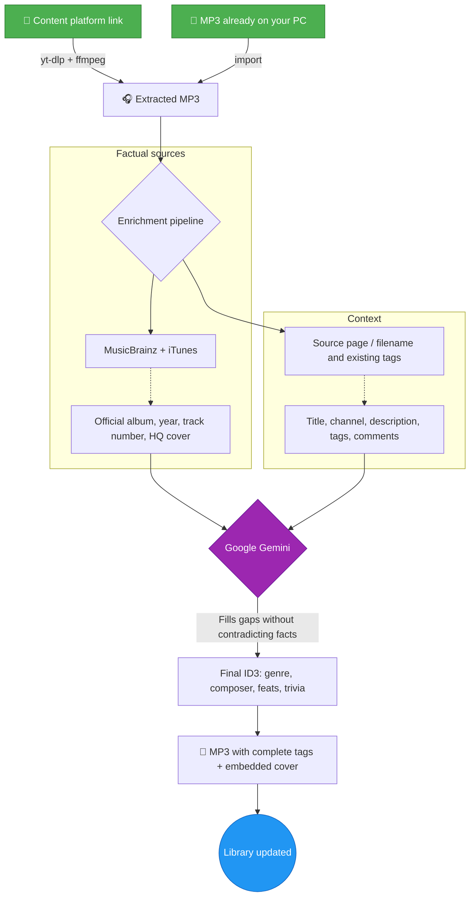
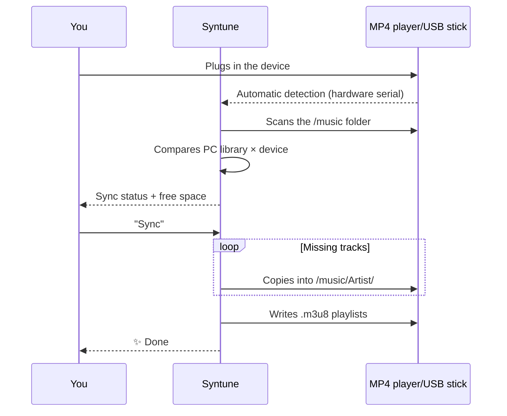

<div align="center">
  

  # 🎵 Syntune

  ### Tu música. Tus archivos. Para siempre.

  **Organiza, enriquece y posee tu biblioteca musical — sin conexión y privada. Acabado de streaming, sin el alquiler.**

  
  
  
  
  

  🌍 [English](../README.md) · [Português (BR)](README.pt-BR.md) · **Español** · [Français](README.fr.md) · [Deutsch](README.de.md) · [Русский](README.ru.md)

  <br>

  [](https://github.com/marcoaur/syntune/releases/latest/download/Syntune-Setup.exe)

  <sub>o consigue la [versión portátil](https://github.com/marcoaur/syntune/releases/latest/download/Syntune-Portable.exe) — sin instalación · [todas las versiones](https://github.com/marcoaur/syntune/releases)</sub>

</div>

---

## 👀 Míralo en acción

<table>
  <tr>
    <td align="center" width="33%">
      <br>
      <sub><b>«Reproduciendo» inmersivo</b> — la interfaz respira los colores del álbum</sub>
    </td>
    <td align="center" width="33%">
      <br>
      <sub><b>Modo karaoke</b> — letra sincronizada en tiempo real</sub>
    </td>
    <td align="center" width="33%">
      <br>
      <sub><b>Editor de letra</b> — sincroniza verso a verso y publica en LRCLIB</sub>
    </td>
  </tr>
</table>

---

## 🌟 Por qué existe

El streaming es alquiler. Un día cambia el catálogo, una canción desaparece de tu lista, la app exige una suscripción — y aquella versión rara que amabas ya no está.

Los archivos locales son **tuyos**. Suenan en el reproductor MP4 de tu bolsillo, en el pendrive del coche, en un PC sin internet, dentro de veinte años. El problema nunca fue tener los archivos — fue cuidarlos: nombres desordenados, «Artista desconocido», portadas que faltan, etiquetas a medias.

**Syntune** cuida esa biblioteca: organiza, identifica, etiqueta, embellece, reproduce y sincroniza tu música — y cuando necesitas una pista a la que tienes derecho, también la trae desde un enlace. Con la precisión de las bases de datos musicales abiertas (y una IA opcional para rellenar los huecos), hace que tus MP3 parezcan un servicio de streaming de primera — sin dejar de ser tuyos.

---

## ✨ Qué hace

| | Función | Por qué importa |
|:--|:--|:--|
| 🧠 | **Enriquecimiento por IA anclado en hechos** | MusicBrainz + iTunes aportan los hechos; Gemini solo rellena los huecos — nunca contradice datos fiables. Adiós a las alucinaciones. |
| 🔑 | **Funciona sin clave de API** | ¿Sin clave de Gemini (o con la IA desactivada)? El **modo factual** etiqueta directamente desde MusicBrainz / iTunes / LRCLIB + portada en alta resolución. La IA es un refuerzo opcional — actívala en Ajustes. |
| 🖼️ | **Portadas en alta resolución** | Carátulas oficiales de Cover Art Archive e iTunes (600×600+), con recorte integrado en el editor. |
| 🎤 | **Letra sincronizada (karaoke)** | Búsqueda automática en LRCLIB + un editor integrado para sincronizar la letra verso a verso. |
| 📡 | **Publica letras en LRCLIB** | ¿Sincronizaste una letra? Publícala desde la app y se convierte en patrimonio público. |
| 📥 | **Trae pistas desde un enlace** | ¿Necesitas una pista a la que tienes derecho? Pega un enlace → MP3 con etiquetas completas y portada en alta. Sin pasos manuales. |
| 🎨 | **Interfaz viva** | El color dominante de cada portada tiñe tarjetas, reproductor y ambiente. Visualizador de espectro en tiempo real. |
| 🔊 | **Reproductor completo** | Cola, aleatorio, repetición, listas, modo «Reproduciendo» a pantalla completa. |
| 🎛️ | **Ecualizador de 6 bandas** | Graves, medios y agudos en tiempo real vía Web Audio — moldea el sonido a tu gusto. |
| 🖧 | **Sincronización con dispositivos** | Detecta reproductores MP4/pendrives al conectarlos, replica tu biblioteca en `/music/Artista/` y escribe listas `.m3u8`. |
| 📊 | **Estadísticas globales + scrobbling** | Biografías, oyentes y reproducciones vía Last.fm — y tus escuchas alimentan tu perfil. |
| 🪶 | **Realmente ligero** | Portadas servidas por un protocolo nativo (cero base64 en el heap de JS), audio transmitido directo del disco, contenido fuera de pantalla omitido al renderizar. |

---

## 🔄 Cómo un enlace — o un archivo que ya tienes — se vuelve una pista perfecta

El flujo pone los **hechos antes que la IA** — las bases de datos musicales son la fuente primaria; Gemini es el especialista que completa y normaliza:



Y luego, sin que lo pidas: la letra sincronizada llega de LRCLIB y la foto del artista, de Genius.

---

## 🚦 Cola inteligente — añade 30 canciones a la vez

El motor de cola respeta los límites de la API de Gemini **por modelo** (RPM, TPM y RPD, persistidos entre sesiones), procesa los enriquecimientos en el orden en que terminan las descargas y muestra en la interfaz la espera estimada cuando tiene que pausar.

**Modelo recomendado: `gemini-3.1-flash-lite`** — rápido y con límites de capa gratuita mucho más generosos:

| Modelo | RPM | TPM | RPD |
|:--|:--:|:--:|:--:|
| **`gemini-3.1-flash-lite`** ⭐ | **15** | **250 000** | **500** |
| `gemini-2.5-flash` | 5 | — | — |

Cada pista usa como mucho 2 solicitudes — con flash-lite enriqueces música **3× más rápido** sin chocar con los límites de tasa.

---

## 🖧 Tu reproductor MP4, siempre al día



La copia se ejecuta en un hilo de trabajo — la interfaz nunca se congela. Las pistas que solo existen en el dispositivo pueden traerse de vuelta, enriquecerse y volver a sincronizarse.

---

## 🤲 Impulsado por servicios gratuitos — y devolviendo a ellos

Esta app solo es posible porque hay personas que mantienen, gratis, algunos de los mayores tesoros de datos musicales de internet. Y este es el detalle del que estamos orgullosos: **Syntune no solo consume — devuelve.**

| Servicio | Qué usamos | Qué devolvemos |
|:--|:--|:--|
| [MusicBrainz](https://musicbrainz.org) | Álbum oficial, año, número de pista | Límite de tasa respetado a rajatabla (1 sol./s); puedes [editar y completar datos](https://musicbrainz.org/doc/How_to_Contribute) |
| [Cover Art Archive](https://coverartarchive.org) | Portadas oficiales en alta | — |
| [LRCLIB](https://lrclib.net) | Letra sincronizada | **Las letras que sincronizas en el editor se publican de vuelta** — cada aporte se convierte en karaoke para todo el mundo |
| [Last.fm](https://www.last.fm) | Biografías, estadísticas globales | **Scrobblear tus escuchas** alimenta los datos de popularidad globales |
| [Genius](https://genius.com) | Fotos de artistas | — |
| iTunes Search | Género, año, portadas | — |

### 💛 Por qué importa contribuir

Los servicios gratuitos de datos musicales viven de un pacto silencioso: cada persona que corrige una etiqueta en MusicBrainz, publica una letra en LRCLIB o scrobblea una escucha está construyendo la infraestructura que el próximo usuario recibirá lista. No hay una empresa detrás que garantice nada — hay personas.

Si esta app te ayudó, considera devolver algo al ecosistema:

- 🎼 **¿Sincronizaste una letra?** Publícala en LRCLIB desde la app — basta un clic.
- ✏️ **¿Viste datos erróneos?** Corrígelos en [MusicBrainz](https://musicbrainz.org) — tu edición beneficia a millones.
- 📷 **¿Tienes la portada oficial de un álbum raro?** Súbela al [Cover Art Archive](https://coverartarchive.org).
- 💶 **¿Puedes donar?** La [Fundación MetaBrainz](https://metabrainz.org/donate) mantiene MusicBrainz con vida.

Los datos abiertos son como una biblioteca pública: solo existen mientras la comunidad los cuida.

### 💿 Y sobre todo: paga por la música

La forma más directa de cuidar la música que amas es **comprarla**. Un MP3 adquirido en una plataforma de confianza es tuyo para siempre — sin DRM, sin suscripción, sin catálogo que desaparece — y pone dinero en el bolsillo de quien la creó:

- 🎸 **[Bandcamp](https://bandcamp.com)** — el estándar de oro: la mayor parte va directo al artista, descargas MP3/FLAC sin DRM
- 🎵 **[Qobuz](https://www.qobuz.com)** y **[7digital](https://www.7digital.com)** — tiendas de descarga de alta calidad
- 🛒 Las tiendas de MP3 de **Amazon Music** e **iTunes/Apple Music**

Comprar directamente a los **artistas** es un acto de curaduría: votas, con dinero, por la música que quieres que siga existiendo.

### 🎙️ Y si creas — crea más

La otra cara de la moneda: también devuelves a la música **creándola**. Si produces tu propia música, **usa esta herramienta para darle un acabado profesional**: etiquetas ID3 completas, una portada incrustada en alta resolución, letra sincronizada, el nombre del compositor en su sitio. Es el toque final que separa una maqueta suelta en una carpeta de una obra lista para viajar — en tu reproductor MP4, en el pendrive de un amigo, en Bandcamp.

Esta app organiza tu colección — pero eres tú quien decide qué entra en ella. Incluido tu propio arte.

---

## 🚀 Primeros pasos

### 📦 1. Descarga

**Windows x64**
- **[⬇️ Instalador — Syntune-Setup.exe](https://github.com/marcoaur/syntune/releases/latest/download/Syntune-Setup.exe)** *(recomendado)*
- **[⬇️ Portátil — Syntune-Portable.exe](https://github.com/marcoaur/syntune/releases/latest/download/Syntune-Portable.exe)** — sin instalación, ejecútalo desde donde quieras

**macOS** (Apple Silicon) y **Linux** — consigue el `.dmg` / `.AppImage` / `.deb` en la **[última versión](https://github.com/marcoaur/syntune/releases/latest)**.
> Las compilaciones de macOS y Linux aún no están firmadas — macOS puede advertir («desarrollador no identificado»); clic derecho → Abrir. AppImage: `chmod +x` y ejecuta.

Sin requisitos previos: `yt-dlp` y `ffmpeg` se descargan automáticamente la primera vez que la app los necesita.

### ⚙️ 2. Configuración inicial

1. Abre **⚙️ Ajustes** en la app
2. *(Opcional)* Pega una **clave de API de Gemini** gratuita ([consíguela en Google AI Studio](https://aistudio.google.com/apikey)) para el enriquecimiento por IA — *sin clave (o con el interruptor «Usar IA» desactivado), la app funciona en **modo factual** usando MusicBrainz / iTunes / LRCLIB. Se guarda localmente en `userData/config.json`; nunca sale de tu equipo*
3. Elige tu carpeta de biblioteca musical
4. *(Opcional)* Añade un token de **Genius** para fotos de artistas ([Genius API](https://genius.com/api-clients)) y una clave de **Last.fm** para estadísticas y scrobbling ([Last.fm API](https://www.last.fm/api/account/create))

### 🧑‍💻 Ejecutar desde el código (desarrolladores)

Requiere [Node.js](https://nodejs.org/) 18+ (probado en v22):

```bash
git clone https://github.com/marcoaur/syntune.git
cd syntune
npm install
npm start
```

### 🏗️ Compilación de producción

```bash
npm run dist
```

Genera los instaladores en `dist/`. La compilación está optimizada: ffmpeg bajo demanda, máxima compresión.

---

## 🛠️ Stack y arquitectura

Minimalismo deliberado: **dos dependencias de producción** (`node-id3`, `yt-dlp-wrap`) y un frontend 100% vanilla.

```
main.js          Proceso principal — descargas, flujo Gemini, ID3, detección USB
preload.js       Puente IPC seguro (contextBridge, contextIsolation)
sync-worker.js   Hilo de trabajo — escaneo y copia sin congelar la interfaz
i18n.js          Internacionalización (resuelta desde el locale del sistema)
renderer/        JS + CSS vanilla — cero frameworks, cero dependencias
```

**Decisiones de rendimiento que vale la pena estudiar:**

- 🚀 **Protocolos personalizados** (`mp3file://`, `mp3cover://`, `mp3artist://`) — audio transmitido directo del disco y portadas servidas a la caché nativa de imágenes de Chromium. Sin base64 inflando el heap de JS, sin búferes duplicados por IPC.
- 🦥 **Perezoso en cada capa** — portadas con `loading="lazy"` + esqueleto, `content-visibility: auto` omite el render fuera de pantalla, lecturas ID3 que solo tocan la cabecera del archivo.
- 🎨 **Canvas API** para extraer la paleta de cada portada; **Web Audio API** para el visualizador de espectro.
- 🧵 **Hilos de trabajo** para la E/S pesada de sincronización.

---

## 🤝 Contribuir

Errores, ideas, nuevas fuentes de metadatos, mejoras de interfaz — todo es bienvenido.

```bash
# 1. Haz fork y clona
# 2. Crea tu rama
git checkout -b feature/MiIdea
# 3. Haz commit
git commit -m "feat: mi idea increíble"
# 4. Haz push y abre un Pull Request
git push origin feature/MiIdea
```

Áreas donde la ayuda marcaría una diferencia real:

- 🌍 Nuevos idiomas (solo añade un archivo JSON a `locales/`)
- 🐧 Detección de dispositivos USB en Linux/macOS (hoy solo Windows)
- 🎵 Nuevas fuentes de metadatos (¿Discogs? ¿Deezer?)
- ♿ Accesibilidad

---

## ⚖️ Aviso legal

Este software está pensado para el **uso personal con tu propio contenido o contenido debidamente licenciado** — tus grabaciones, material con licencia abierta o contenido al que tienes derecho de acceder sin conexión. Respeta los términos de servicio de las plataformas desde las que importas contenido y las leyes de derechos de autor de tu país. Los autores no respaldan ni se responsabilizan del mal uso de esta herramienta.

---

## 📄 Licencia

[GPL-3.0](LICENSE) — úsalo, estúdialo, modifícalo, compártelo. Con una garantía extra: **todo derivado de este proyecto sigue siendo libre**. Quien lo modifique y redistribuya debe mantener el código abierto, bajo esta misma licencia, preservando los créditos. Tu trabajo — y el de todos los que contribuyen — nunca se convierte en el producto cerrado de otro.

---

<div align="center">

**Hecho con 💜 para quienes creen que una biblioteca musical es algo que se cultiva — no algo que se alquila.**

🎧 *Hagamos que las bibliotecas locales vuelvan a brillar.*

</div>
