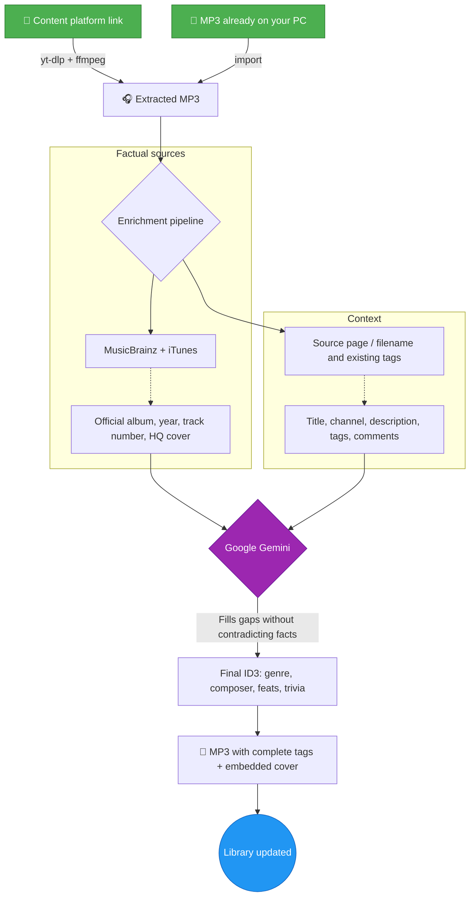
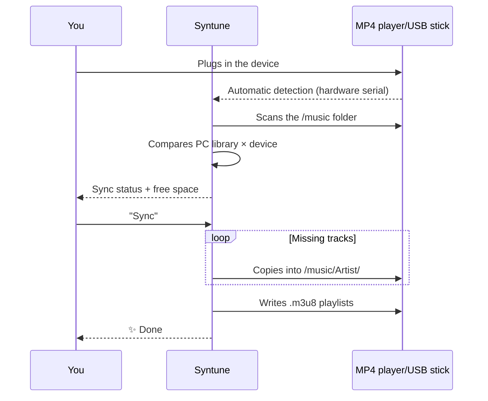

<div align="center">
  

  # 🎵 Syntune

  ### Votre musique. Vos fichiers. Pour toujours.

  **Organisez, enrichissez et possédez votre bibliothèque musicale — hors ligne et privée. La finition du streaming, sans la location.**

  
  
  
  
  

  🌍 [English](../README.md) · [Português (BR)](README.pt-BR.md) · [Español](README.es.md) · **Français** · [Deutsch](README.de.md) · [Русский](README.ru.md)

  <br>

  [](https://github.com/marcoaur/syntune/releases/latest/download/Syntune-Setup.exe)

  <sub>ou récupérez la [version portable](https://github.com/marcoaur/syntune/releases/latest/download/Syntune-Portable.exe) — sans installation · [toutes les versions](https://github.com/marcoaur/syntune/releases)</sub>

</div>

---

## 👀 En action

<table>
  <tr>
    <td align="center" width="33%">
      <br>
      <sub><b>« Lecture en cours » immersive</b> — l'interface respire les couleurs de l'album</sub>
    </td>
    <td align="center" width="33%">
      <br>
      <sub><b>Mode karaoké</b> — paroles synchronisées en temps réel</sub>
    </td>
    <td align="center" width="33%">
      <br>
      <sub><b>Éditeur de paroles</b> — synchronisez ligne par ligne et publiez sur LRCLIB</sub>
    </td>
  </tr>
</table>

---

## 🌟 Pourquoi ça existe

Le streaming, c'est de la location. Un jour le catalogue change, un titre disparaît de votre playlist, l'app exige un abonnement — et cette version rare que vous aimiez n'est plus là.

Les fichiers locaux sont **à vous**. Ils se lisent sur le baladeur MP4 dans votre poche, sur la clé USB de la voiture, sur un PC sans internet, dans vingt ans. Le problème n'a jamais été de posséder les fichiers — c'était d'en prendre soin : noms en désordre, « Artiste inconnu », pochettes manquantes, tags à moitié vides.

**Syntune** prend soin de cette bibliothèque : il organise, identifie, étiquette, embellit, lit et synchronise votre musique — et quand vous avez besoin d'un titre auquel vous avez droit, il le récupère aussi depuis un lien. Avec la précision des bases de données musicales ouvertes (et une IA optionnelle pour combler les lacunes), il donne à vos MP3 l'allure d'un service de streaming haut de gamme — sans jamais cesser d'être les vôtres.

---

## ✨ Ce qu'il fait

| | Fonction | Pourquoi c'est important |
|:--|:--|:--|
| 🧠 | **Enrichissement par IA ancré dans les faits** | MusicBrainz + iTunes fournissent les faits ; Gemini comble seulement les lacunes — sans jamais contredire des données fiables. Adieu les hallucinations. |
| 🔑 | **Fonctionne sans clé API** | Pas de clé Gemini (ou IA désactivée) ? Le **mode factuel** étiquette directement depuis MusicBrainz / iTunes / LRCLIB + pochette haute résolution. L'IA est un renfort optionnel — activez-la dans les Paramètres. |
| 🖼️ | **Pochettes haute résolution** | Visuels officiels de Cover Art Archive et iTunes (600×600+), avec recadrage intégré dans l'éditeur. |
| 🎤 | **Paroles synchronisées (karaoké)** | Recherche automatique sur LRCLIB + un éditeur intégré pour synchroniser les paroles ligne par ligne. |
| 📡 | **Publiez des paroles sur LRCLIB** | Vous avez synchronisé des paroles ? Publiez-les depuis l'app, elles deviennent un patrimoine public. |
| 📥 | **Récupérez des titres depuis un lien** | Besoin d'un titre auquel vous avez droit ? Collez un lien → MP3 avec tags complets et pochette haute résolution. Aucune étape manuelle. |
| 🎨 | **Interface vivante** | La couleur dominante de chaque pochette teinte les cartes, le lecteur et l'ambiance. Visualiseur de spectre en temps réel. |
| 🔊 | **Lecteur complet** | File d'attente, aléatoire, répétition, playlists, mode « Lecture en cours » plein écran. |
| 🎛️ | **Égaliseur 6 bandes** | Graves, médiums et aigus en temps réel via Web Audio — façonnez le son à votre goût. |
| 🖧 | **Synchronisation d'appareils** | Détecte les baladeurs MP4/clés USB au branchement, réplique votre bibliothèque dans `/music/Artiste/` et écrit des playlists `.m3u8`. |
| 📊 | **Statistiques mondiales + scrobbling** | Biographies, auditeurs et écoutes via Last.fm — et vos écoutes alimentent votre profil. |
| 🪶 | **Vraiment léger** | Pochettes servies par un protocole natif (zéro base64 dans le tas JS), audio diffusé directement du disque, contenu hors écran ignoré au rendu. |

---

## 🔄 Comment un lien — ou un fichier que vous avez déjà — devient un titre parfait

Le pipeline place les **faits avant l'IA** — les bases de données musicales sont la source primaire ; Gemini est le spécialiste qui complète et normalise :



Et ensuite, sans que vous le demandiez : les paroles synchronisées arrivent de LRCLIB et la photo de l'artiste vient de Genius.

---

## 🚦 File intelligente — ajoutez 30 titres d'un coup

Le moteur de file respecte les limites de l'API Gemini **par modèle** (RPM, TPM et RPD, conservées entre les sessions), traite les enrichissements dans l'ordre de fin des téléchargements et affiche l'attente estimée dans l'interface lorsqu'il doit faire une pause.

**Modèle recommandé : `gemini-3.1-flash-lite`** — rapide, avec des limites de palier gratuit bien plus généreuses :

| Modèle | RPM | TPM | RPD |
|:--|:--:|:--:|:--:|
| **`gemini-3.1-flash-lite`** ⭐ | **15** | **250 000** | **500** |
| `gemini-2.5-flash` | 5 | — | — |

Chaque titre utilise au plus 2 requêtes — avec flash-lite, vous enrichissez la musique **3× plus vite** sans heurter les murs de limitation.

---

## 🖧 Votre baladeur MP4, toujours à jour



La copie s'exécute dans un thread de travail — l'interface ne se fige jamais. Les titres qui n'existent que sur l'appareil peuvent être rapatriés, enrichis et resynchronisés.

---

## 🤲 Propulsé par des services gratuits — et leur rendre la pareille

Cette app n'est possible que parce que des gens maintiennent, gratuitement, certains des plus grands trésors de données musicales d'internet. Et voici le détail dont nous sommes fiers : **Syntune ne fait pas que consommer — il redonne.**

| Service | Ce que nous utilisons | Ce que nous redonnons |
|:--|:--|:--|
| [MusicBrainz](https://musicbrainz.org) | Album officiel, année, numéro de piste | Limite de débit scrupuleusement respectée (1 req/s) ; vous pouvez [éditer et compléter les données](https://musicbrainz.org/doc/How_to_Contribute) |
| [Cover Art Archive](https://coverartarchive.org) | Pochettes officielles haute résolution | — |
| [LRCLIB](https://lrclib.net) | Paroles synchronisées | **Les paroles que vous synchronisez dans l'éditeur sont republiées** — chaque contribution devient du karaoké pour le monde entier |
| [Last.fm](https://www.last.fm) | Biographies, statistiques mondiales | **Le scrobbling de vos écoutes** alimente les données de popularité mondiales |
| [Genius](https://genius.com) | Photos d'artistes | — |
| iTunes Search | Genre, année, pochettes | — |

### 💛 Pourquoi contribuer compte

Les services gratuits de données musicales reposent sur un pacte silencieux : chaque personne qui corrige un tag sur MusicBrainz, publie des paroles sur LRCLIB ou scrobble une écoute construit l'infrastructure que le prochain utilisateur recevra toute prête. Il n'y a pas d'entreprise derrière pour garantir quoi que ce soit — il y a des gens.

Si cette app vous a aidé, pensez à redonner à l'écosystème :

- 🎼 **Synchronisé des paroles ?** Publiez-les sur LRCLIB depuis l'app — un seul clic.
- ✏️ **Repéré des données erronées ?** Corrigez-les sur [MusicBrainz](https://musicbrainz.org) — votre édition profite à des millions.
- 📷 **Vous avez la pochette officielle d'un album rare ?** Téléversez-la sur le [Cover Art Archive](https://coverartarchive.org).
- 💶 **Vous pouvez faire un don ?** La [Fondation MetaBrainz](https://metabrainz.org/donate) maintient MusicBrainz en vie.

Les données ouvertes, c'est comme une bibliothèque publique : elles n'existent que tant que la communauté en prend soin.

### 💿 Et surtout : payez pour la musique

La façon la plus directe de prendre soin de la musique que vous aimez, c'est de **l'acheter**. Un MP3 acheté sur une plateforme de confiance est à vous pour toujours — sans DRM, sans abonnement, sans catalogue qui s'évapore — et il met de l'argent dans la poche de celui qui l'a créée :

- 🎸 **[Bandcamp](https://bandcamp.com)** — la référence : l'essentiel va directement à l'artiste, téléchargements MP3/FLAC sans DRM
- 🎵 **[Qobuz](https://www.qobuz.com)** et **[7digital](https://www.7digital.com)** — boutiques de téléchargement haute qualité
- 🛒 Les boutiques MP3 d'**Amazon Music** et d'**iTunes/Apple Music**

Acheter directement aux **artistes** est un acte de curation : vous votez, avec votre argent, pour la musique que vous voulez voir continuer d'exister.

### 🎙️ Et si vous créez — créez davantage

L'autre face de la médaille : vous redonnez aussi à la musique en **la créant**. Si vous produisez votre propre musique, **servez-vous de cet outil pour lui donner un rendu professionnel** : tags ID3 complets, une pochette intégrée en haute résolution, des paroles synchronisées, le nom du compositeur à la bonne place. C'est la touche finale qui distingue une maquette perdue dans un dossier d'une œuvre prête à voyager — sur votre baladeur MP4, sur la clé USB d'un ami, sur Bandcamp.

Cette app organise votre collection — mais c'est vous qui décidez de ce qui y entre. Y compris votre propre art.

---

## 🚀 Pour commencer

### 📦 1. Téléchargement

**Windows x64**
- **[⬇️ Installateur — Syntune-Setup.exe](https://github.com/marcoaur/syntune/releases/latest/download/Syntune-Setup.exe)** *(recommandé)*
- **[⬇️ Portable — Syntune-Portable.exe](https://github.com/marcoaur/syntune/releases/latest/download/Syntune-Portable.exe)** — sans installation, à lancer depuis n'importe où

**macOS** (Apple Silicon) et **Linux** — récupérez le `.dmg` / `.AppImage` / `.deb` dans la **[dernière version](https://github.com/marcoaur/syntune/releases/latest)**.
> Les builds macOS et Linux ne sont pas encore signés — macOS peut avertir (« développeur non identifié ») ; clic droit → Ouvrir. AppImage : `chmod +x` puis lancez.

Aucun prérequis : `yt-dlp` et `ffmpeg` sont téléchargés automatiquement la première fois que l'app en a besoin.

### ⚙️ 2. Configuration initiale

1. Ouvrez **⚙️ Paramètres** dans l'app
2. *(Facultatif)* Collez une **clé API Gemini** gratuite ([obtenez-la sur Google AI Studio](https://aistudio.google.com/apikey)) pour l'enrichissement par IA — *sans clé (ou avec l'option « Utiliser l'IA » désactivée), l'app fonctionne en **mode factuel** avec MusicBrainz / iTunes / LRCLIB. Stockée localement dans `userData/config.json` ; elle ne quitte jamais votre machine*
3. Choisissez le dossier de votre bibliothèque musicale
4. *(Facultatif)* Ajoutez un jeton **Genius** pour les photos d'artistes ([Genius API](https://genius.com/api-clients)) et une clé **Last.fm** pour les statistiques et le scrobbling ([Last.fm API](https://www.last.fm/api/account/create))

### 🧑‍💻 Lancer depuis les sources (développeurs)

Nécessite [Node.js](https://nodejs.org/) 18+ (testé sur v22) :

```bash
git clone https://github.com/marcoaur/syntune.git
cd syntune
npm install
npm start
```

### 🏗️ Build de production

```bash
npm run dist
```

Génère les installateurs dans `dist/`. Le build est optimisé : ffmpeg à la demande, compression maximale.

---

## 🛠️ Stack & architecture

Minimalisme assumé : **deux dépendances de production** (`node-id3`, `yt-dlp-wrap`) et un frontend 100 % vanilla.

```
main.js          Processus principal — téléchargements, pipeline Gemini, ID3, détection USB
preload.js       Pont IPC sécurisé (contextBridge, contextIsolation)
sync-worker.js   Thread de travail — analyse et copie sans figer l'interface
i18n.js          Internationalisation (résolue depuis la locale du système)
renderer/        JS + CSS vanilla — zéro framework, zéro dépendance
```

**Choix de performance qui valent le détour :**

- 🚀 **Protocoles personnalisés** (`mp3file://`, `mp3cover://`, `mp3artist://`) — audio diffusé directement du disque et pochettes servies au cache d'images natif de Chromium. Pas de base64 qui gonfle le tas JS, pas de buffers dupliqués par IPC.
- 🦥 **Paresseux à chaque couche** — pochettes en `loading="lazy"` + squelette, `content-visibility: auto` ignore le rendu hors écran, lectures ID3 limitées à l'en-tête du fichier.
- 🎨 **Canvas API** pour extraire la palette de chaque pochette ; **Web Audio API** pour le visualiseur de spectre.
- 🧵 **Threads de travail** pour les E/S de synchronisation lourdes.

---

## 🤝 Contribuer

Bugs, idées, nouvelles sources de métadonnées, finitions d'interface — tout est le bienvenu.

```bash
# 1. Forkez et clonez
# 2. Créez votre branche
git checkout -b feature/MonIdee
# 3. Committez
git commit -m "feat: mon idée géniale"
# 4. Poussez et ouvrez une Pull Request
git push origin feature/MonIdee
```

Domaines où l'aide ferait une vraie différence :

- 🌍 Nouvelles langues (ajoutez simplement un fichier JSON dans `locales/`)
- 🐧 Détection d'appareils USB sur Linux/macOS (Windows uniquement pour l'instant)
- 🎵 Nouvelles sources de métadonnées (Discogs ? Deezer ?)
- ♿ Accessibilité

---

## ⚖️ Mention légale

Ce logiciel est destiné à un **usage personnel avec votre propre contenu ou un contenu dûment licencié** — vos enregistrements, du matériel sous licence ouverte ou du contenu auquel vous avez le droit d'accéder hors ligne. Respectez les conditions d'utilisation des plateformes depuis lesquelles vous importez du contenu et les lois sur le droit d'auteur de votre pays. Les auteurs n'approuvent pas et ne sont pas responsables d'un usage abusif de cet outil.

---

## 📄 Licence

[GPL-3.0](LICENSE) — utilisez-le, étudiez-le, modifiez-le, partagez-le. Avec une garantie en plus : **tout dérivé de ce projet reste libre**. Quiconque le modifie et le redistribue doit garder le code ouvert, sous cette même licence, en préservant les crédits. Votre travail — et celui de tous les contributeurs — ne devient jamais le produit fermé de quelqu'un d'autre.

---

<div align="center">

**Fait avec 💜 pour ceux qui pensent qu'une bibliothèque musicale se cultive — et ne se loue pas.**

🎧 *Faisons à nouveau briller les bibliothèques locales.*

</div>
